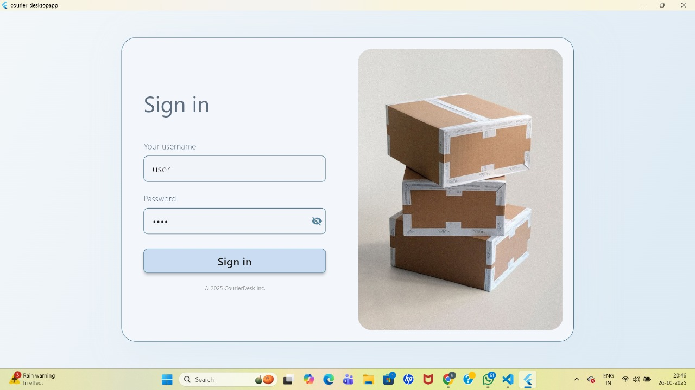
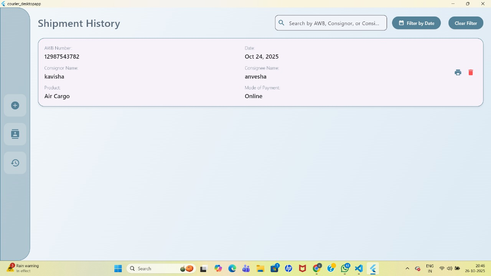
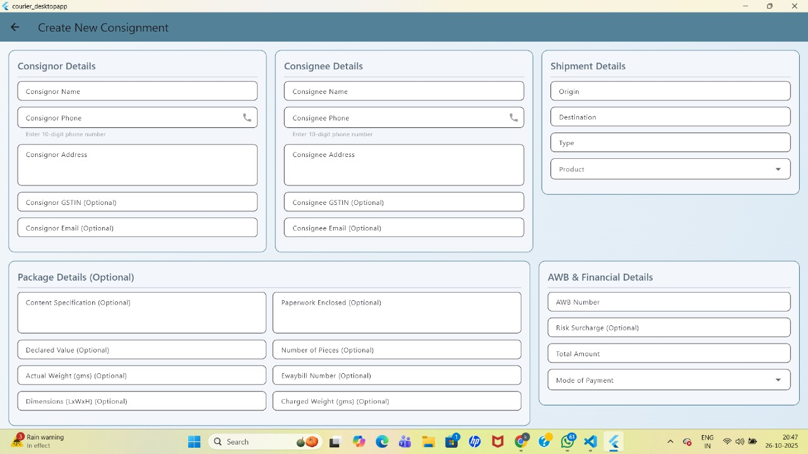
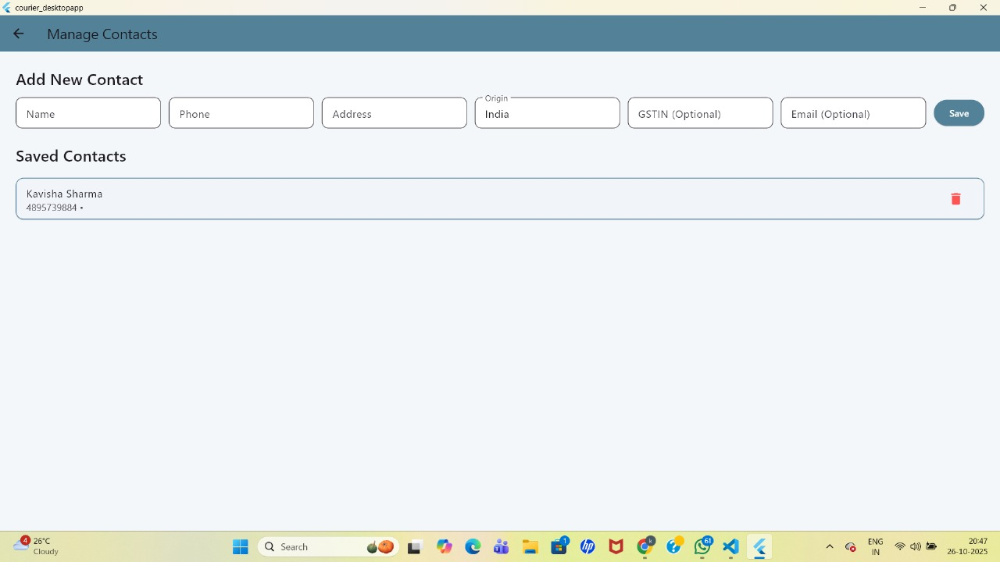

# Courier Billing Desktop App


##  Overview

**Courier Billing Desktop App** is a lightweight, cross-platform desktop billing and consignment management system built using **Flutter (Desktop)** and **Hive (Local Database)**. It is designed for small courier businesses to manage consignments, generate PDF receipts, and perform quick data lookups — all without needing an internet connection.

This project also demonstrates **Operating System concepts** such as process management, memory allocation (through Hive’s data storage in virtual memory), and file management at the application level.

---

##  Key Features

*  **Consignment Management:** Add, view, and delete consignments easily.
*  **Search & Filter:** Search consignments by AWB number, consignor, or consignee. Filter data by date.
*  **Local Storage:** Uses Hive for fast, persistent, and schema-less storage without SQL.
*  **Authentication:** Simple local login system.
*  **PDF Receipt Generation:** Instantly generate and print professional courier receipts.
*  **Offline Functionality:** Works entirely offline — perfect for local courier offices.
*  **OS Concepts Demonstrated:**

  * **Memory Allocation:** Data is managed through Hive boxes in virtual memory before being persisted to local storage.
  * **File Management:** Consignments and receipts are stored in structured binary files (Hive boxes) that mimic file system management.
  * **Process Simulation:** Each user action (add, delete, search) is treated as an independent lightweight process within Flutter’s asynchronous framework.

---

##  Tech Stack

| Component            | Technology                          |
| -------------------- | ----------------------------------- |
| **Frontend / UI**    | Flutter (Material Design)           |
| **Database**         | Hive (Local NoSQL)                  |
| **PDF Generation**   | `pdf` & `printing` Flutter packages |
| **State Management** | Provider                            |
| **Platform**         | Windows / macOS / Linux             |

---

##  Project Structure

```
lib/
│
├── models/                  # Data models (Consignment, Contact)
├── providers/               # State management logic using Provider
├── services/                # Core logic: HiveService, AuthService, PDF generation
├── screens/                 # UI screens (Home, Login, History, etc.)
└── main.dart                # Application entry point
```

###  Folder Breakdown

* **models/** → Defines data structure (e.g., Consignment with fields like Product, Date, Mode of Payment).
* **providers/** → Controls app state, manages authentication, filters, and UI updates.
* **services/** → Handles logic like local storage (Hive), authentication, and PDF receipt creation.
* **screens/** → Contains Flutter widgets for user interaction.
* **main.dart** → Starts the app and initializes Hive boxes.

---

##  Installation & Setup

1. **Clone the Repository:**

   ```bash
   git clone https://github.com/kavisha2035/Courier-Billing-Desktop-App.git
   cd Courier-Billing-Desktop-App
   ```

2. **Install Dependencies:**

   ```bash
   flutter pub get
   ```

3. **Run the App (Desktop):**

   ```bash
   flutter run -d windows
   ```

4. **Hive Setup:**
   Hive will automatically create a local box (`consignments.hive`) in your app data directory.

---

##  Example Workflow

1. **Login** using credentials (default: user / pass)
2. **Add New Consignment** with details like product, consignor, consignee, etc.
3. **View or Search** consignments.
4. **Filter by Date** to view specific-day records.
5. **Generate PDF Receipt** for printing or record-keeping.

---

##  OS Concepts Explained

| Concept                | How It Appears in Project                                                                   |
| ---------------------- | ------------------------------------------------------------------------------------------- |
| **Memory Allocation**  | Data first stored in memory (RAM) within Hive’s runtime boxes before writing to disk.       |
| **File Management**    | Hive stores objects in binary files that simulate block-level file access.                  |
| **Virtual Memory**     | Flutter uses Dart’s heap memory to manage temporary object storage for fast retrieval.      |
| **Process Scheduling** | Each operation (add/delete/filter) is a separate asynchronous event loop task.              |
| **Persistent Storage** | Data is serialized and stored in the user’s local file system under the Hive box directory. |

---

##  Preview


Authorization screen 

Main screen

New Consignment creating screen

Adding new contacts screen


---

##  Contributors

**Developed by:**
 Kavisha Sharma & Darshna Ajudia
**B.Tech in Information and Communication Technology**
*OS + Flutter Integration Project*

---

## 📜 License

This project is open source and available under the [MIT License](LICENSE).

---

**GitHub Repository:** [kavisha2035/Courier-Billing-Desktop-App](https://github.com/kavisha2035/OS_Resource_Monitor)
